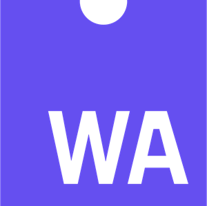
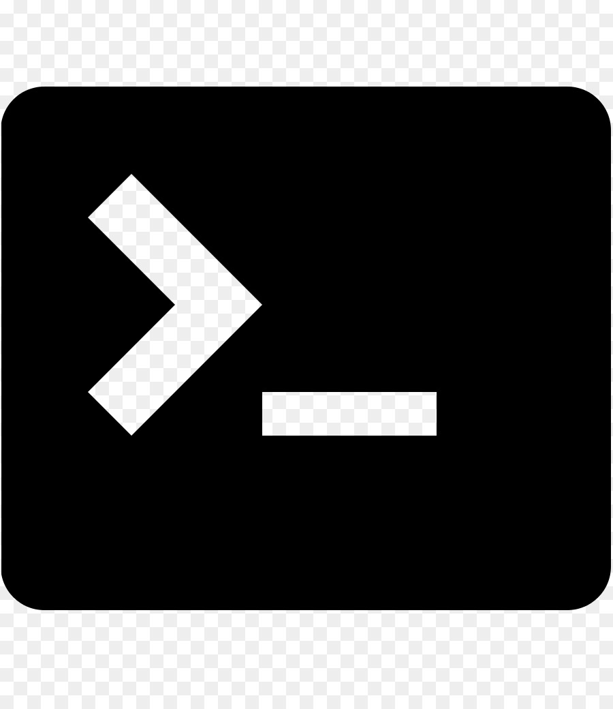

### Hi there, I'm Nilaksh 👋

- 🌱 I’m currently learning React and node.js
- 👯 I’m looking to collaborate on any fun and exciting projects 🙃
- 🥅 2020 Goals: Contribute more to Open Source projects
- 💬 Always up for beer🍺, new food🍔 and a game of Dota
- ⚡ Fun fact: I love to read fiction📕 and play video games🎮
- Currently reading [Approaching (almost) any machine learning problem by Abhishek Thakur](https://www.amazon.in/Approaching-Almost-Machine-Learning-Problem-ebook/dp/B089P13QHT)

### Connect with me:

### Languages and Tools:

